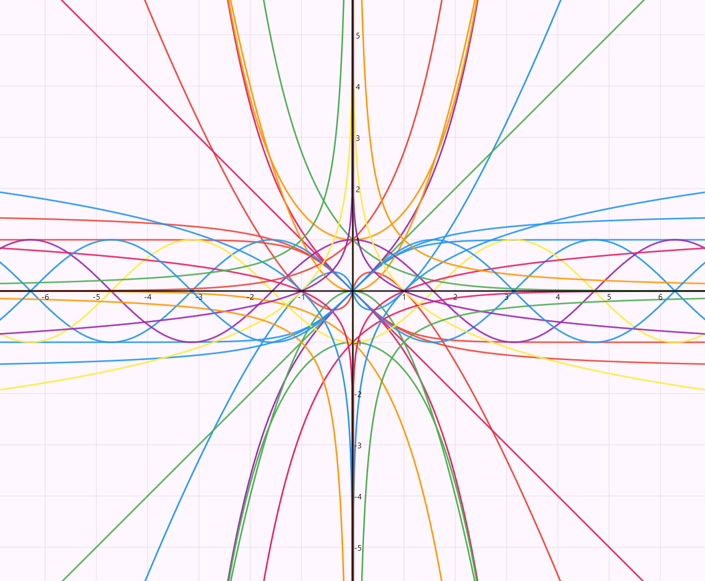

# aIzebra
A mathematical expression parser and evaluator in rust and a graphical app connected in flutter.



## Compile aIzebra lib
Execute these commands to create the new libs
```
cargo ndk -t x86_64 -o ./bin build --release

cargo ndk -t arm64-v8a -o ./bin build --release

cargo build --release --target-dir ./bin/windows --lib  
```